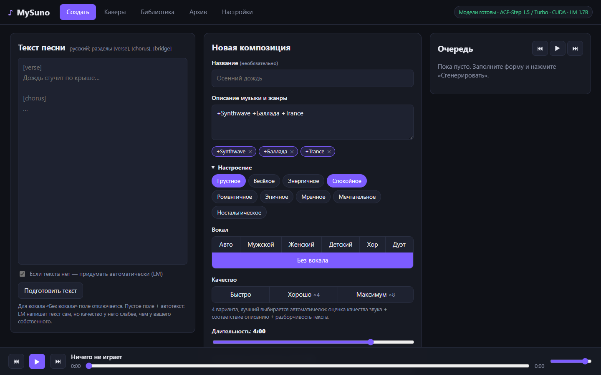
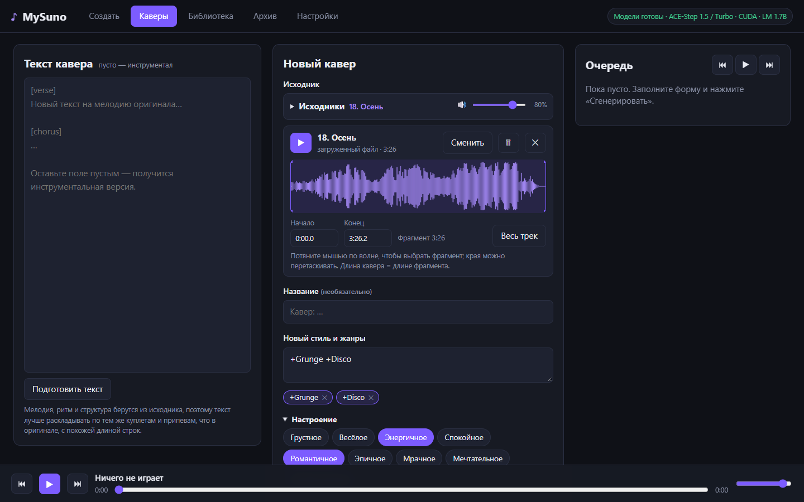
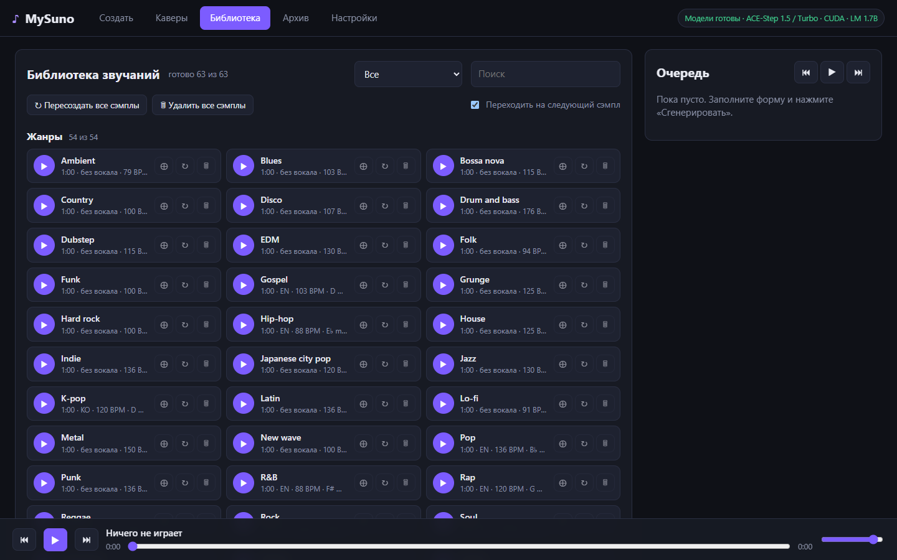
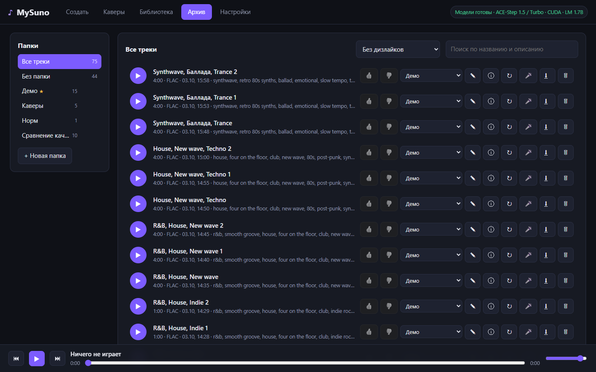
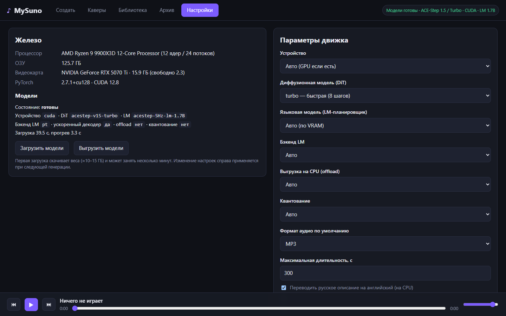

# MySuno — локальный генератор музыки

Однопользовательское веб-приложение: русскоязычные промпты → музыка на open-source модели
**[ACE-Step 1.5](https://github.com/ace-step/ACE-Step-1.5)** (MIT) на GPU или CPU. Всё работает локально,
сервер слушает только `127.0.0.1`.

## Быстрый старт

```powershell
powershell -ExecutionPolicy Bypass -File setup.ps1   # один раз: Python, зависимости, веса (~10–15 ГБ)
run.bat                                              # запуск; откроется http://127.0.0.1:8000
```

Права администратора не нужны. Модели загружаются и прогреваются в фоне (~30–50 с); готовность видна по плашке
в правом верхнем углу («Модели готовы»). Если плашка просит перезапустить run.bat — сбой видеокарты, процесс нужно
перезапустить.

## Скриншоты

| Создать | Каверы |
|---|---|
|  |  |
| **Библиотека** | **Архив** |
|  |  |
| **Настройки** | |
|  | |

## Возможности

| Раздел | Что есть |
|---|---|
| **Создать** | русское описание с жанрами прямо в тексте (`+Жанр` — добавить, `-Жанр` — исключить, экспериментально; список с подсказками понимает русские названия), настроение, вокал (авто / мужской / женский / детский / хор / дуэт / без вокала), свой русский текст или авто-текст от LM, длительность, температура, качество («Быстро» / «Хорошо ×4» / «Максимум ×8» — лучший вариант выбирается автоматически), число композиций за раз, расширенные параметры (варианты до 16, шаги, guidance, BPM, seed, сэмплер Euler / Heun / SDE, формат, папка, LM-планирование) |
| **Каверы** | исходник (загруженный файл или трек из архива), фрагмент на волне, новый стиль, текст (пусто — инструментал), способ («Авто» / «По нотам» / «Перекраска»), близость к оригиналу |
| **Библиотека** | минутные сэмплы каждого жанра и настроения, чтобы услышать, как модель их понимает: прослушивание подряд, пересоздание и удаление по одному или всех сразу, ⊕ — вставить жанр в форму «Создать», фильтр и поиск |
| **Архив** | папки, плеер, лайки/дизлайки, переименование, перенос, скачивание, удаление, подробности генерации, ↻ загрузка параметров трека в редактор (точный повтор для одиночной генерации) |
| **Настройки** | железо, устройство (авто / GPU / CPU), DiT (turbo / sft / base), LM (авто / выкл. / 0.6B / 1.7B), ускоренный LM-декодер, offload, INT8, формат, лимит длительности, загрузка/выгрузка моделей |

Общее:
- Очередь задач с прогрессом и плеером (⏮ ⏯ ⏭, автопереход); выполняющуюся генерацию можно остановить.
- Содержимое форм «Создать» и «Каверы» сохраняется на сервере (`data/ui_state.json`) и восстанавливается при открытии.
- Название по умолчанию — выбранные жанры; повторяющиеся названия получают суффиксы «1», «2», …
- Настроение и исходники сворачиваются; в свёрнутом виде видно, что выбрано.

### Как промпт попадает в модель
1. Жанры, настроение и вокал → английские теги (`mysuno/presets.py`).
2. Русское описание → перевод ru→en на CPU (`Helsinki-NLP/opus-mt-ru-en`, включается в настройках).
3. Английский `caption` и русский текст песни уходят в ACE-Step; LM-планировщик подбирает структуру, BPM и тональность.

### Каверы
- **По нотам** (task `cover`): модель заново исполняет музыку по семантическим кодам исходника — сильная смена стиля;
  лучше всего на треках, сгенерированных MySuno.
- **Перекраска** (FlowEdit): LM описывает исходник, и звук плавно переводится из этого описания в новый стиль —
  сохраняются гармония и тайминг живых записей.
- **Авто** (по умолчанию): варианты делаются обоими способами, лучший выбирается по качеству звука, новому стилю
  и узнаваемости оригинала.
- Загруженные исходники хранятся в `data/sources/`; длина кавера равна длине выбранного фрагмента.

### Библиотека звучаний
- Для каждого жанра и настроения создаётся минутный сэмпл: в запросе только этот жанр или настроение,
  остальное (вокал, текст, темп) решает LM.
- Жанры звучат без вокала, кроме вокальных (поп, рэп, госпел, шансон, опера…); поют по-английски, кроме жанров
  с «родным» языком (эстрада и шансон — по-русски, K-pop — по-корейски, опера — по-итальянски…); настроения — по-русски.
- Сэмплы не попадают в архив: файлы и `index.json` лежат в `data/samples/`; только что созданные ненадолго подсвечиваются.

## Скорость (RTX 5070 Ti, turbo, модели в памяти)

| Задача | Время |
|---|---|
| трек 30 с / 120 с / 240 с (с LM) | 3.1 с / 9.8 с / 19.1 с |
| трек 120 с без LM | 3.7 с |
| кавер 60 с, «Быстро» (Авто, 2 варианта, sft) | ~50 с |
| CPU-режим, 10 с без LM | 15.5 с |

## Структура

```
setup.ps1, run.bat, requirements-extra.txt
mysuno/    server.py (FastAPI) · engine.py (ACE-Step, каверы) · jobs.py (очередь) · db.py (архив треков, SQLite)
           sources.py (исходники каверов) · samples.py (библиотека звучаний) · presets.py · lyrics.py · translate.py · quality.py (оценка вариантов)
           fastlm.py, lmhandler.py (ускоренный LM-декодер) · audio.py · config.py · download.py (веса) · web/ (HTML/CSS/JS без сборки)
scripts/   bench.py, smoke_test.py, api_e2e.py, api_stress.py — скорость и сквозные проверки
           quality_lab.py, cover_lab.py, cover_check.py — замеры качества генерации и каверов
tests/     python -m unittest discover -s tests -t .
data/      library.db, settings.json, ui_state.json, tracks/, sources/, samples/ — ваши данные (не в git)
docs/      screenshots/ — скриншоты для README
vendor/    ACE-Step-1.5 (+ .venv и checkpoints)
python/    Python 3.12 (подписанный, с python.org)
```

## Windows
- Smart App Control блокирует неподписанные бинарники, поэтому используется официальный подписанный Python 3.12 в `python/`.
- Кэши и Python лежат внутри папки проекта.
- MP3 кодируется через `soundfile` — `ffmpeg` не нужен.

## Тесты

```powershell
vendor\ACE-Step-1.5\.venv\Scripts\python.exe -m unittest discover -s tests -t .   # GPU-тесты пропускаются, если VRAM занята
vendor\ACE-Step-1.5\.venv\Scripts\python.exe scripts\smoke_test.py                # генерация без UI
```
